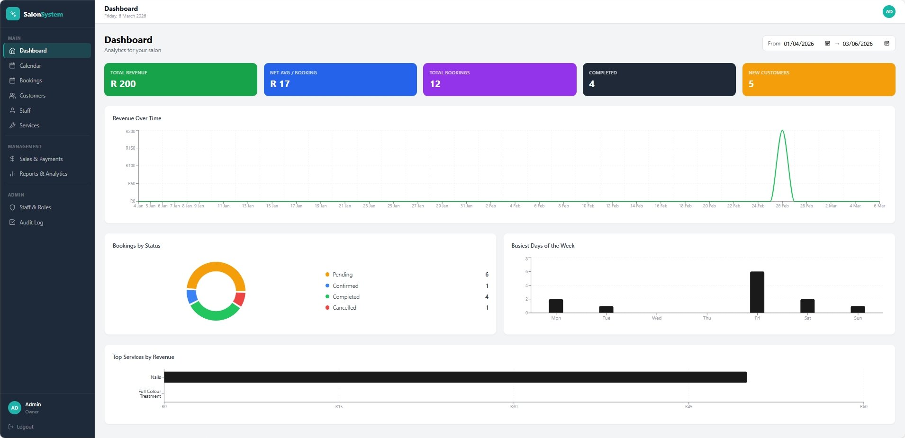
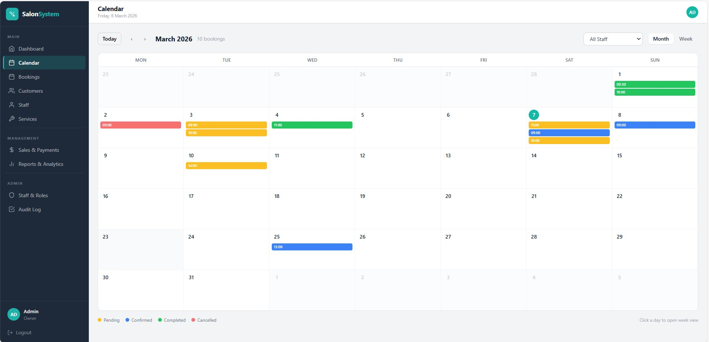
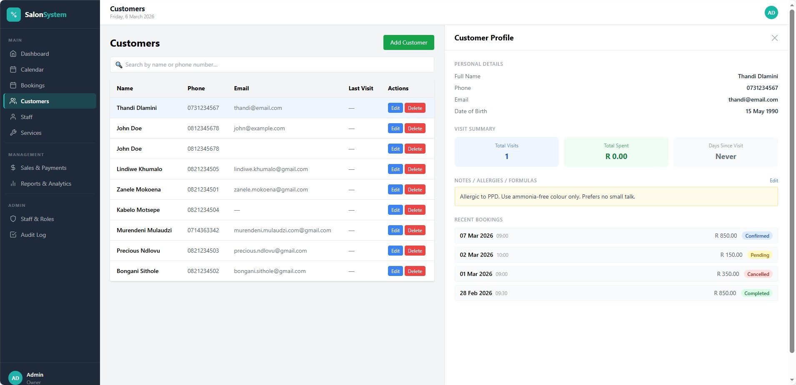
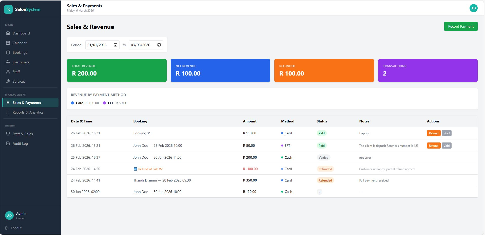
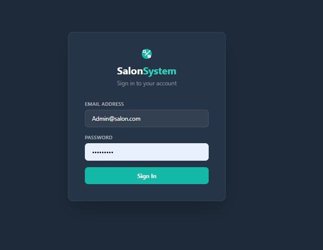

# SalonSystem

A full-stack salon management platform built with **ASP.NET Core 8 (Clean Architecture)** and **React 18 + TypeScript**.

Enables salon owners to manage bookings, customers, staff, services, sales, and user accounts through secure role-based access control and real-time business analytics dashboards.

> **Stack:** ASP.NET Core 8 · Entity Framework Core · SQL Server · React 18 · TypeScript · Tailwind CSS · JWT Auth · xUnit

---

## Screenshots

### Dashboard — Analytics & Revenue Overview

*Revenue over time, bookings by status, busiest days of the week, and top services by revenue — all updating dynamically based on the selected date range.*

---

### Booking Calendar — Month View

*Colour-coded booking blocks by status: Pending (yellow), Confirmed (blue), Completed (green), Cancelled (red). Staff filter and month/week toggle.*

---

### Customer Management — Profile Panel

*Split-panel view: customer list with search on the left, full profile on the right showing personal details, visit summary, notes/allergies/formulas, and recent booking history with status badges.*

---

### Sales & Payments — Revenue Tracking

*Summary cards for Total Revenue, Net Revenue, Refunded, and Transactions. Payment list with method, status, refund and void actions per transaction.*

---

### Login — Authentication

*Dark-themed login screen with teal branding. Supports forced password change on first login for Owner-created accounts.*

---

## Tech Stack

### Backend
- ASP.NET Core 8
- Clean Architecture (Domain / Application / Infrastructure / API)
- Entity Framework Core 8
- SQL Server
- JWT Bearer Authentication
- BCrypt Password Hashing

### Frontend
- React 18 + TypeScript
- Tailwind CSS
- Axios (JWT interceptor)
- Recharts (Analytics dashboards)
- React Router v6

### Testing
- xUnit + Moq + FluentAssertions
- Fluent builder pattern for test data

---

## Implemented Features

### Authentication & Security
- Role-based access control (Owner, Reception, Staff)
- JWT authentication with claims-based authorization
- BCrypt password hashing
- Secure 12-character temporary password generation for Owner-created accounts
- Forced password change on first login (`MustChangePassword` flag)
- Account activation / deactivation by Owner

### Booking Management
- Full booking lifecycle: `Pending → Confirmed → Completed → Cancelled`
- Booking creation, editing, confirmation, completion, cancellation
- Colour-coded calendar view (month and week)
- Soft delete — records never permanently removed
- Booking history visible in customer profiles

### Customer Management
- Full CRUD with soft delete
- Customer profile — booking history, total visits, total spend, days since last visit
- Notes field for allergies, preferences, colour formulas
- Search by name or phone number

### Staff Management
- Full CRUD with soft delete
- Staff schedule view — daily appointments per staff member
- Service specialisations per staff member
- Clean separation between `User` (login account) and `Staff` (employee record)

### Services Management
- Full CRUD with soft delete
- Active / Inactive status per service
- Duration and base price management

### Sales & Payments
- Record payments (Cash, Card, EFT, Voucher)
- Multiple payments per booking (deposit + balance)
- Refund recording
- Void payments — record stays in DB, financial integrity preserved
- Revenue summary — Total Revenue, Total Refunded, Net Revenue, Transactions

### Analytics Dashboard
- Revenue over time (line chart)
- Bookings by status (donut chart)
- Busiest days of the week (bar chart)
- Top 5 services by revenue (horizontal bar chart)
- Dynamic date range picker — all charts update together

### Audit Logging
- Every state change writes an `AuditLog` record
- Before/after JSON snapshots on updates
- Audit history per entity (bookings, customers, staff, services, sales)
- Logs are immutable — never deleted

### Unit Testing
- xUnit + Moq + FluentAssertions
- AAA (Arrange / Act / Assert) throughout
- Fluent builder pattern — `BookingBuilder`, `CustomerBuilder`, `StaffBuilder`, `SaleBuilder`, etc.
- Coverage: Auth, Bookings, Users, Sales, Customers, Services, Staff handlers

---

## Architecture Overview

The backend follows Clean Architecture — each layer depends only on the layer inside it:

| Layer | Project | Responsibility |
|---|---|---|
| Domain | `Salon.Domain` | Entities, interfaces, domain exceptions. Zero external dependencies. |
| Application | `Salon.Application` | Use case handlers, DTOs, business logic. |
| Infrastructure | `Salon.Infrastructure` | EF Core, repository implementations, BCrypt hasher. |
| API | `Salon.API` | Controllers, middleware, dependency injection. |

Business rules live inside domain methods — `booking.Complete()` enforces that only `Confirmed` bookings can be completed. The rule lives in one place and cannot be bypassed from any caller.

### Key Architectural Decisions

| Decision | Reason |
|---|---|
| Domain methods on entities | Rules enforced at source — impossible to bypass from any caller |
| User separate from Staff | A login account and an employee record are different concepts |
| Soft delete across all entities | Audit trail and booking history are never broken |
| Audit log on all state changes | Full traceability — who changed what and when |
| String status instead of enum | Survives EF Core migrations cleanly; domain methods enforce valid transitions |
| Generated password returned once | Plain-text discarded after display — only BCrypt hash stored |
| No JWT decoding on frontend | Backend returns role and email directly — no coupling to token structure |
| Sales voided not deleted | Financial records are never removed — voids and refunds are recorded instead |

---

## Authentication Flow

1. User logs in via `POST /api/auth/login`
2. Backend verifies password using `BCrypt.Verify()`
3. JWT generated with `sub` (UserId), `email`, and `role` claims
4. Frontend stores full auth object in `localStorage`
5. Axios interceptor attaches `Authorization: Bearer <token>` on every request
6. 401 responses auto-clear storage and redirect to `/login`
7. If `mustChangePassword == true` → redirect to `/change-password`

---

## Running Locally

### Prerequisites
- .NET 8 SDK
- Node.js 18+
- SQL Server (LocalDB supported)

### Backend

```bash
# Apply migrations
dotnet ef database update --project Salon.Infrastructure --startup-project Salon.API

# Run API
dotnet run --project Salon.API
```

Swagger UI: `https://localhost:7001/swagger`

### Frontend

```bash
cd salon-frontend
npm install
npm run dev
```

Frontend: `http://localhost:5173`

### First-Time Setup
1. Register the Owner account via Swagger: `POST /api/auth/register`
2. Log in at `http://localhost:5173`
3. Create staff and reception accounts from User Accounts page
4. Add staff members and services
5. Start creating bookings

---

## Testing

```bash
dotnet test
```

Tests follow AAA (Arrange / Act / Assert) with fluent builder helpers:

```csharp
var booking = new BookingBuilder()
    .WithId(1)
    .WithStatus(BookingStatus.Confirmed)
    .WithStaffId(2)
    .Build();
```

---

## Engineering Roadmap

### High Priority
- **Double-booking prevention** — interval overlap validation per staff member
- **Staff working hours** — configurable availability per day of week
- **Buffer time between appointments**
- Integration tests (xUnit + EF Core InMemory)

### Medium Priority
- Commission engine (percentage, fixed, tiered strategies)
- Staff commission reporting
- Exportable PDF / Excel financial reports
- Daily reconciliation

### Lower Priority
- Multi-branch support
- Domain events (`SaleRecorded`, `BookingCompleted`)
- Caching for analytics endpoints
- Docker containerisation + CI/CD pipeline
- Cloud deployment (Azure / AWS)

---

## Project Status

Core system is feature-complete and actively being hardened — double-booking prevention, staff availability, and the commission engine are next.

---

## License

MIT License

---

## Author

**Murendeni Mulaudzi**
Full-Stack .NET Developer · Johannesburg, South Africa
GitHub: [github.com/murendeni242](https://github.com/murendeni242)
